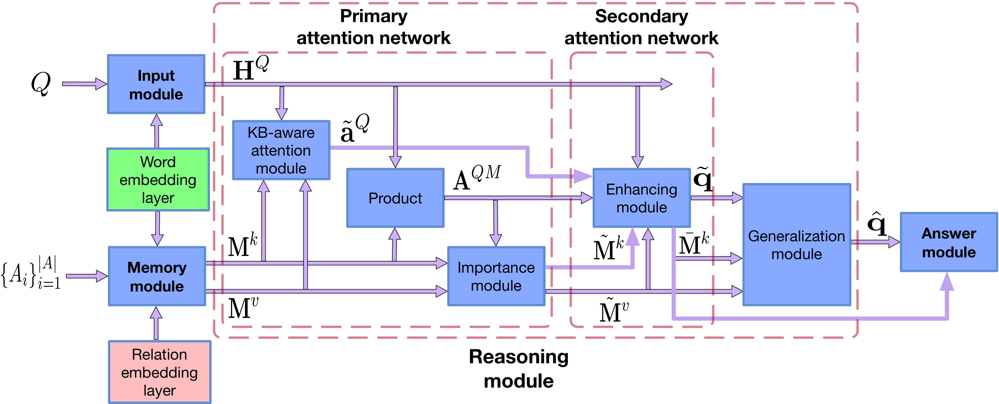
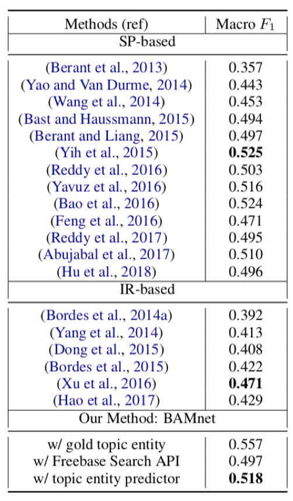
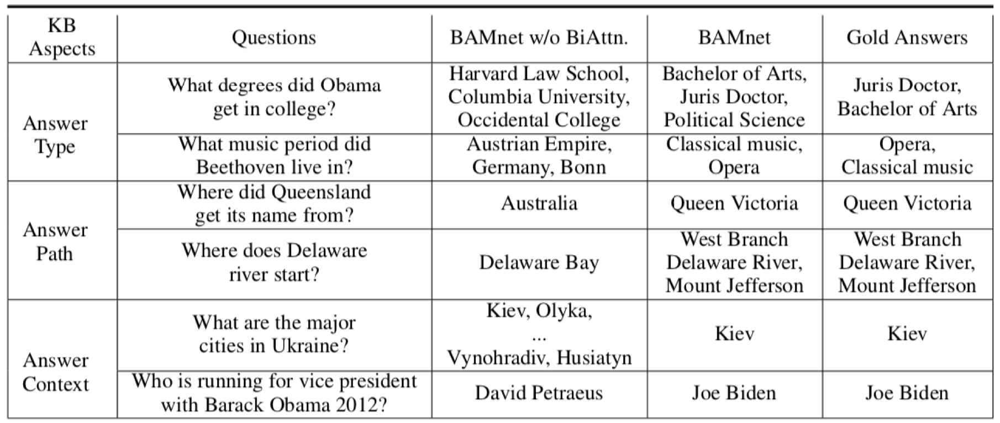
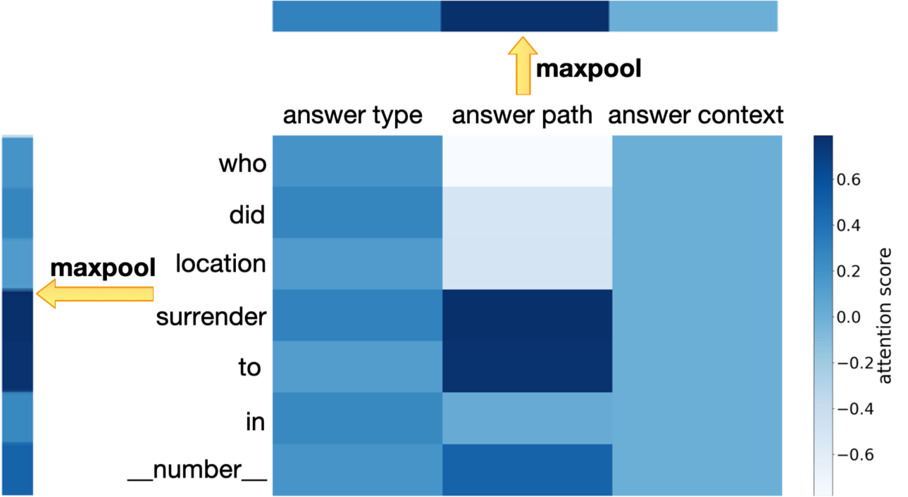

# BAMnet


Code accompanying the paper ["Bidirectional Attentive Memory Networks for Question Answering over Knowledge Bases"](https://arxiv.org/abs/1903.02188)


## Get started


### Prerequisites
This code is written in python 3. You will need to install a few python packages in order to run the code.
We recommend you to use `virtualenv` to manage your python packages and environments.
Please take the following steps to create a python virtual environment.

* If you have not installed `virtualenv`, install it with ```pip install virtualenv```.
* Create a virtual environment with ```virtualenv venv```.
* Activate the virtual environment with `source venv/bin/activate`.
* Install the package requirements with `pip install -r requirements.txt`.


### Run the KBQA system

* Download the preprocessed data from [here](https://1drv.ms/u/s!AjiSpuwVTt09gSE2niFGjdIVsqA7?e=PEf6sT) and put the data folder under the root directory.


* Create a folder (e.g., `runs/WebQ/`) to save model checkpoint. You can download the pretrained models from [here](https://1drv.ms/u/s!AjiSpuwVTt09gSLcnrp0GyKtpWBg?e=DtqYt8).


* Please modify the config files in the `src/config/` folder to suit your needs. Note that you can start with modifying only the data folder (e.g., `data_dir`, `model_file`, `pre_word2vec`) and vocab size (e.g., `vocab_size`, `num_ent_types`, `num_relations`), and leave other hyperparameters as they are.


* Go to the `BAMnet/src` folder, train the BAMnet model

	```
	python train.py -config config/bamnet_webq.yml
	```
	

*  Test the BAMnet model (with ground-truth topic entity)
	
	```
	python test.py -config config/bamnet_webq.yml
	```

*  Train the topic entity predictor

	```
	python train_entnet.py -config config/entnet_webq.yml
	```

*  Test the topic entity predictor

	```
	python test_entnet.py -config config/entnet_webq.yml
	```

*  Test the whole system (BAMnet + topic entity predictor)

	```
	python joint_test.py -bamnet_config config/bamnet_webq.yml -entnet_config config/entnet_webq.yml -raw_data ../data/WebQ
	```


### Preprocess the dataset on your own

* Go to the `BAMnet/src` folder, to prepare data for the BAMnet model, run the following cmd:

	```
	python build_all_data.py -data_dir ../data/WebQ -fb_dir ../data/WebQ -out_dir ../data/WebQ
	```
	
* To prepare data for the topic entity predictor model, run the following cmd:

	```
	python build_all_data.py -dtype ent -data_dir ../data/WebQ -fb_dir ../data/WebQ -out_dir ../data/WebQ
	```


 Note that in the message printed out, your will see some data statistics such as `vocab_size`, `num_ent_types `, `num_relations`. These numbers will be used later when modifying the config files.


* Download the pretrained Glove word ebeddings [glove.840B.300d.zip](http://nlp.stanford.edu/data/wordvecs/glove.840B.300d.zip).

* Unzip the file and convert glove format to word2vec format using the following cmd:

	```
	python -m gensim.scripts.glove2word2vec --input glove.840B.300d.txt --output glove.840B.300d.w2v
	```

* Fetch the pretrained Glove vectors for our vocabulary.

	```
	python build_pretrained_w2v.py -emb glove.840B.300d.w2v -data_dir ../data/WebQ -out ../data/WebQ/glove_pretrained_300d_w2v.npy -emb_size 300
	```


## Architecture

<center></center>


## Experiment results on WebQuestions


### Results on WebQuestions test set. Bold: best in-category performance. 


<center></center>


### Predicted answers of BAMnet w/ and w/o bidirectional attention on the WebQuestions test set




### Attention heatmap generated by the reasoning module




## Reference

If you found this code useful, please consider citing the following paper:

Yu Chen, Lingfei Wu, Mohammed J. Zaki. **"Bidirectional Attentive Memory Networks for Question Answering over Knowledge Bases."** *In Proc. 2019 Annual Conference of the North American Chapter of the Association for Computational Linguistics (NAACL-HLT2019). June 2019.*


	@article{chen2019bidirectional,
	  title={Bidirectional Attentive Memory Networks for Question Answering over Knowledge Bases},
	  author={Chen, Yu and Wu, Lingfei and Zaki, Mohammed J},
	  journal={arXiv preprint arXiv:1903.02188},
	  year={2019}
	}
